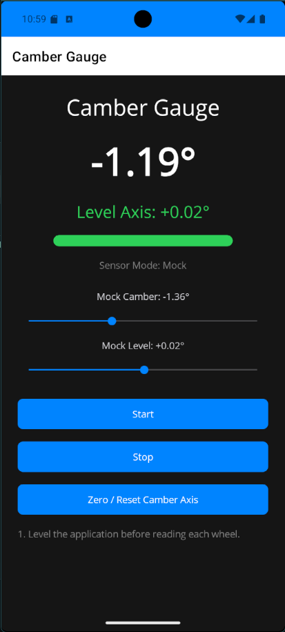
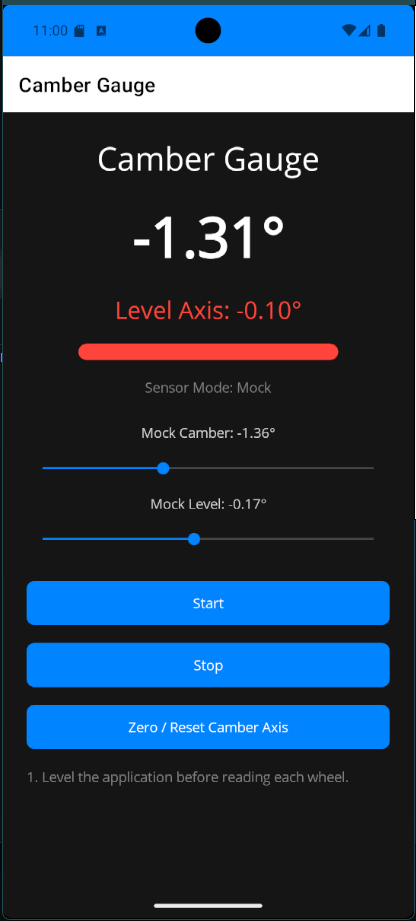
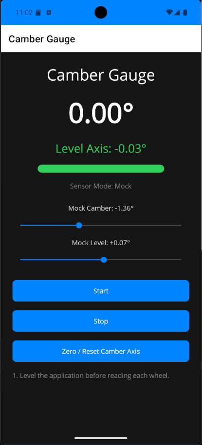

# 📐 CamberGauge

---

> 🚧 **Under Construction**
>
> This project is actively being developed and refined. Features, UI, and accuracy are still evolving.

> ⚠️ **Disclaimer**
>
> This application is intended for **educational and enthusiast use only**. Measurements should be verified using professional alignment equipment before making any mechanical adjustments. Use at your own risk.

---

A modern, cross-platform mobile application built with **.NET MAUI** that transforms your smartphone into a precision **wheel camber measurement tool**.

Designed with real-world usability in mind, CamberGauge leverages device sensors, smoothing algorithms, and a clean architecture to provide stable, accurate readings for automotive enthusiasts and motorsports applications.

---

## 🚀 Why This Project Stands Out

This isn’t just a UI demo—it’s a **real-world engineering tool** that demonstrates:

* Separation of concerns (UI vs. domain logic)
* Hardware abstraction and simulation
* Testable architecture with a dedicated Core library
* Thoughtful UX design for physical interaction scenarios

---

## 🧠 Key Features

### 📊 Real-Time Camber Measurement

* Uses device accelerometer to calculate camber angle
* Displays values in degrees with clear positive/negative direction

### 🎯 Level Detection with Visual Feedback

* Dynamic color feedback (🟢 / 🔴) based on tolerance thresholds
* Designed to ensure proper device orientation before measurement

### 🧮 Signal Smoothing

* Exponential smoothing applied to sensor data
* Reduces jitter and improves readability in real-world conditions

### 🔄 Zero / Reset Workflow

* Allows users to calibrate against a reference surface
* Matches real-world alignment workflows

### 🔔 Smart Feedback

* Haptic feedback triggers **only when entering level zone**
* Prevents noisy, repetitive alerts

### 🎛️ Mock Sensor Mode (Developer Feature)

* Interactive sliders simulate camber and level
* Enables rapid UI/logic testing without physical hardware
* Demonstrates dependency injection and abstraction

---

## 🏗️ Architecture

The project follows a clean, layered design:

```text
CamberGauge (MAUI App)
│
├── Views (XAML UI)
├── ViewModels (MVVM logic)
├── Services (Sensor abstraction)
│
└── CamberGauge.Core (Class Library)
    ├── Models
    ├── Helpers (AngleMath)
    └── Settings
```

### 🔌 Dependency Injection

Sensor access is abstracted via:

```text
IAngleSensorService
 ├── AccelerometerAngleSensorService (real device)
 └── MockAngleSensorService (simulation)
```

This allows seamless switching between real and mock data:

```csharp
AppFeatureFlags.UseMockSensorData = true/false;
```

---

## 🧪 Testing Strategy

A dedicated test project validates core logic independent of UI/framework concerns:

### ✔️ Covered Areas

* Angle smoothing behavior
* Data model integrity
* Configuration defaults

### 🧠 Design Decision

All testable logic is extracted into **CamberGauge.Core**, enabling:

* Fast, reliable unit tests
* No dependency on MAUI or device APIs
* Clean separation of business logic

---

## 📱 Platform Support

* ✅ Android (primary dev/test platform)
* ✅ iOS (via Mac/Xcode integration)
* ⚠️ Emulator support for UI only (sensor simulation limited)

---

## 🛠️ Tech Stack

* **.NET MAUI**
* **C#**
* **MVVM Architecture**
* **Dependency Injection**
* **xUnit (unit testing)**

---

## 🔮 Future Enhancements

* Calibration UI for axis selection and inversion
* “Hold / Lock Reading” feature for real-world usability
* Session tracking for multi-wheel alignment
* Export/share alignment data
* Pro version (ad-free + advanced features)

---

## 📸 Screenshots

## 🎥 Demo

![Demo]

*Position Good*


*Position Not Good*


*Reset Only Impacts Camber Reading*


---

## 💡 What I Learned

* Designing around **real-world physical interaction**, not just UI
* Building **testable mobile architectures** using Core libraries
* Handling **sensor noise and data smoothing**
* Separating platform-specific concerns from business logic
* Creating developer tooling (mock mode) to accelerate iteration

---

## 👤 Author

D-Ragu

---

## ⭐ Final Note

This project demonstrates the ability to take a practical idea and implement it with **production-level architecture, testability, and user-focused design**.

It is not just an app—it’s a **tool built for real-world use**.
